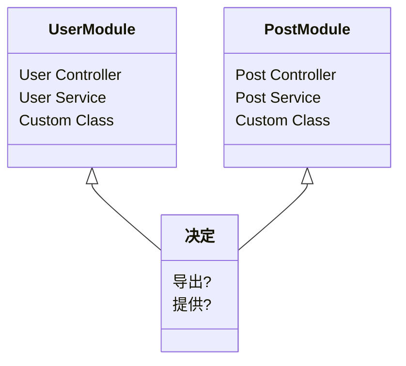

##### 什么是依赖关系

你有一个用户类，一个帖子类，一个页面类

每当创建帖子或者页面时，都需要用户类（因为要检查创建页面或者帖子的用户是否在数据库中，并关联二者）

那么在创建帖子或者页面时，你就需要用户类这个**依赖项**

哦豁，那理论上每次创建帖子或者页面的时候都要随时新建一个用户类了

听上去一下子就变得恶心起来了，因为都让你耦合完了，性能什么的也不用考虑，因为卡爆了

```typescript
class User {
  constructor() {
    console.log("User was instantiated");
  }
  public name = "wx";
}
class Post {
  constructor(private user = new User()) {
    console.log("Post was instantiated");
  }
}
class Page {
  constructor(private user = new User()) {
    console.log("Page was instantiated");
  }
}

//client code
const post = new Post();
const page = new Page();
```

```ini
[LOG]: "User was instantiated"
[LOG]: "Post was instantiated"
[LOG]: "User was instantiated"
[LOG]: "Page was instantiated"
```

不过我们有无需注入的依赖关系方法，也就是**依赖注入**

##### 依赖注入

对的，我生来就是干这个的

不用new创建实例，一手反转控制，只要创建一个实例就可以掌控所有东西，ts可以这么干

```typescript
class User {
  constructor() {
    console.log("User was instantiated");
  }
  public name = "wx";
}

class Post {
  constructor(private user: User) {
    console.log("Post was instantiated");
    console.log(this.user);
  }
}

class Page {
  constructor(private user: User) {
    console.log("Page was instantiated");
  }
}

//nestjs
const user = new User();

//client code
const post = new Post(user);
const page = new Page(user);
```

```ini
[LOG]: "User was instantiated"
[LOG]: "Post was instantiated"
[LOG]: User: {
  "name": "wx"
}
[LOG]: "Page was instantiated"
```

这下只实例一次了

##### nest里的依赖注入

好就好在解耦又方便测试，还有可重用性

那么模块是如何封装这些不同的类，注入依赖呢？

首先理解一件事在nest中，**Module是最高指挥官**，他将所有提供的程序封装其中（service controller customer class）

这意味着Module是**决定**某项特定服务是否导出或者被别人使用。因此，在一个特定模块内写入的所有内容都将保留在一个模块内，由你决定是否共享。比如



你希望`User Controller`使用`User Service`你必须让`UserModule`允许

在其组件内共享服务或任何其他自定义类被称为 **提供**（provider）

其实也就是`module`里的`exports`和 `providers`罢了

那么**模块内**依赖注入分为以下三步

1.声明一个可注入的类

```typescript
@Injectable()
export class AppService {
  getHello(): string {
    return "Hello";
  }
}
```

这就包含可注入装饰器的类就是提供者了

2.然后你得让module知道有这么个东西

```typescript
//app.module.ts
@Module({
  imports: [UserModuler],
  controllers: [AppController],
  providers: [AppService], //这一行
})
export class AppModule {}
```

3.再别的地方用，两种方法，一种是构造方法,一种是属性依赖

```typescript
constructor(private readonly appService: AppService) {}
```

```typescript
@Inject(BService)
private  appService:AppService;
```
